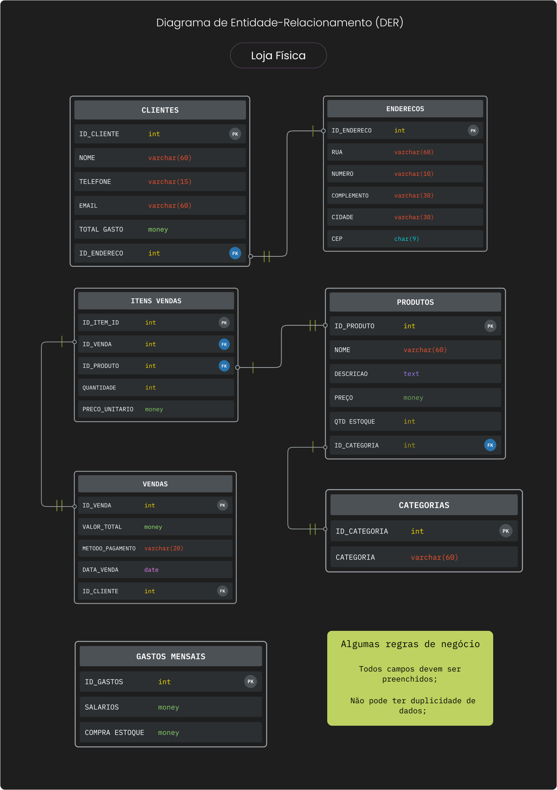

# NextPlay
Este projeto tem como objetivo desenvolver relatórios financeiros detalhados para a empresa NextPlay, utilizando uma base de dados abrangente. A análise envolve:

Lucros e Receitas: Análise de receitas e margens de lucro com base em dados históricos e atuais.
Despesas de Marketing: Acompanhamento dos custos relacionados a campanhas publicitárias.
Projeções de Faturamento: Previsões futuras com base em tendências passadas e presentes.
A solução inclui a criação de uma estrutura de banco de dados para armazenamento e análise desses dados, otimizando a geração de relatórios para tomadas de decisão estratégicas.
 

